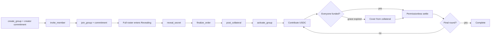

# Ringio

**Your circle, settled on-chain.** Ringio is an invite-only rotating USDC savings protocol for Solana. It translates the social mechanics of an _Altın Günü_ / ROSCA into transparent rounds, PDA custody, deterministic payout order, and explicit collateral protection, presented through a Bauhaus-inspired Next.js experience with privacy-bounded group discovery.

> Ringio is pre-audit MVP software for Solana devnet. The repository does not represent a mainnet deployment or a guarantee against every form of loss.

## What makes the MVP credible

The dangerous ROSCA failure is not “someone paid late.” It is an early recipient taking the pooled payout and then refusing their remaining contributions. Ringio makes that exposure measurable and collateralizes it:

```text
required collateral = contribution × remaining rounds after the member's payout
```

An early recipient locks more; a late recipient locks less. One Group-controlled aggregate collateral vault holds the tokens while each `Member` account tracks its own `collateral_locked` share. After a recipient makes each later contribution, one contribution-sized slice is returned. If they miss a post-payout payment beyond the effective grace window, a permissionless crank can move that slice into the pot.

This guarantee is intentionally narrow. Before someone receives a payout, the protocol contains extraction risk—the member has not taken the pot—but a default can still stop the circle. The MVP addresses that liveness risk with closed invitations, explicit roster acceptance, a grace period, pausing, and clear residual-risk disclosure. Replacement members and portable reputation are roadmap items, not hidden assumptions.

## Lifecycle



The last contributor does not automatically control payout. Settlement is a separate permissionless instruction so any wallet or keeper can advance the circle while the program validates the expected recipient and exact pot amount.

## Product surfaces

- A responsive Next.js product split into three focused views: AI-assisted circle discovery, active-circle management, and an explicit wallet-versus-PDA protection explainer. Detailed member/order/activity data is progressively disclosed.
- Wallet connection with explicit disconnected, connecting, and connected states.
- A non-signing demo transaction review flow with explicit local-preview and no-RPC labels.
- A Bauhaus interface plus Ringio Guide, which decodes eligible devnet Group accounts, ranks only their on-chain economic facts deterministically, and can optionally ask GPT-4o through a server-only OpenRouter adapter to rerank/explain those bounded candidates.
- A **Protection Ratio** that distinguishes collateral coverage from vague “trust scores.”
- An Anchor source program with immutable circle economics, two Group-controlled SPL-token PDA vaults, per-member collateral ledgers, checked arithmetic, events, cumulative paused-time accounting, and permissionless cranks.
- `GET /api/agent/manifest`, a read-only capability document that returns no signable transaction and does not claim Solana Actions/Blinks compliance.
- Grant-ready architecture, demo, deployment, and application documents under `docs/`.

The current program instruction names are `initialize_config`, `set_paused`, `update_pause_authority`, `create_group`, `invite_member`, `join_group`, `reveal_secret`, `finalize_order`, `post_collateral`, `activate_group`, `contribute`, `cover_default`, `settle_round`, `abort_uncovered_round`, `cancel_group`, `refund_failed_round`, and `refund_collateral`. `anchor build` generates an IDL and typed client surface under ignored `target/`. The web server decodes live Group, Member, mint, and vault accounts; financial buttons remain labelled non-signing previews until their wallet transaction builders are wired.

## Status

| Surface | Repository status | Still required before mainnet |
|---|---|---|
| Product UI | Three focused Bauhaus views, Wallet Adapter connection, RPC-decoded Group/Member/SPL vault state with no mock fallback, non-signing previews, and a concrete collateral walkthrough; Node 20 lint/typecheck/build and production HTTP smoke verified against the live devnet Group | Real transaction builders, subscriptions/indexing, hosted deployment, usability testing |
| AI discovery | Bilingual deterministic matcher over eligible on-chain Group accounts; 17/17 web tests cover duration, matching/privacy, and Group/Member binary decoding; optional OpenRouter adapter | Signed creator metadata, durable rate limits/budget monitoring, live-provider evidence |
| Anchor program | Program ID synchronized across source/config/IDL; Rust 1.89 fmt, 16/16 tests, clippy, IDL and SBF builds pass; deploy, config initialization, and a funded two-round devnet lifecycle succeeded | LiteSVM/malicious-account integration, fuzzing, independent audit |
| Custody | One pot vault and one aggregate collateral vault per Group; per-member ledger; no admin withdrawal; funded contribution, payout, default-cover, and zero-vault terminal assertions passed on devnet | Exhaustive adversarial CPI/account tests and independent verification |
| USDC | The completed E2E Group used Circle's six-decimal devnet USDC mint and conserved 20 test USDC across both participant accounts | Wallet transaction enforcement, mainnet mint review and limits; devnet USDC has no financial value |
| Operations | Dedicated repo-external devnet authority, initialized config PDA, cumulative paused-time freeze, permissionless-crank design | Keeper, monitoring, incident drills, multisig authority handoff |

The exact executed checks are reported after each development run; never infer live or repo-wide success from a single passing command.

The pause authority can delay liveness but cannot move or reorder funds. Protocol deadlines are designed to extend by exactly the paused duration since each phase snapshot; same-state calls add no time and a pause after expiry must not revive the boundary. Terminal failed-round and collateral refunds remain callable while paused.

## Local development

### Prerequisites

- Node.js `20.19.4` (`.nvmrc`)
- Rust `1.89.0` (`rust-toolchain.toml`)
- Solana and Anchor CLIs only for SBF build, local validator, or devnet deployment

```bash
nvm use
npm --prefix web ci
cp .env.example web/.env.local
npm run dev
```

Open [http://localhost:3000](http://localhost:3000). The dashboard reads verified devnet accounts and never fills RPC failures with mock data. Its value-moving controls remain explicit non-signing previews because Ringio transaction builders are not wired yet. Leave `OPENROUTER_API_KEY` empty for deterministic group matching, or set it only in the server-side environment to test optional provider mode.

Program unit tests:

```bash
cargo test -p ringio
```

The repository-wide local check is:

```bash
npm run check
```

This validates frontend and Rust source. The current artifact is deployed on devnet, the config is initialized, the server reads it through public RPC, and `web/scripts/devnet-e2e.ts` has completed one funded two-member lifecycle with explorer-verifiable signatures. That single happy/default-path run is not a substitute for adversarial local-validator coverage or an audit.

The full toolchain and devnet sequence are documented in `docs/devnet-runbook.md`.

## Repository map

```text
programs/ringio/    Anchor program, state machine, errors, invariant tests
web/                Next.js App Router dashboard and wallet UX
docs/               Architecture, AI matching, threat model, demo, deployment, grant evidence
.superstack/        Machine-readable build decisions and verification status
brand.md            Ringio's provisional visual and voice system
```

## Security posture

Ringio uses one immutable settlement mint per circle; there is no client-supplied price and no oracle conversion in the MVP. That removes a large DeFi attack surface, but it does not remove program, stablecoin, wallet, or operational risk. Read `SECURITY.md` and `docs/architecture.md` before testing value flows.

## Grant

This project is being prepared for Superteam's [Agentic Engineering Grant](https://superteam.fun/earn/grants/agentic-engineering). `docs/grant-application.md` keeps verified current evidence separate from the August 18 grant-funded milestones. Personal form fields and the applicant wallet are intentionally not duplicated in the repository.
