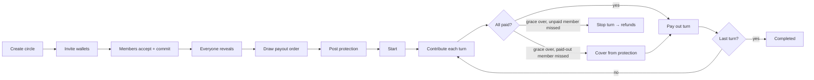

# Ringio

**Save together. Get paid in turns.** Ringio is an invite-only rotating savings circle (ROSCA, _Altın Günü_) on Solana. Members contribute the same USDC amount every turn, one member receives the pot each turn, and members who are paid early lock collateral for the turns they still owe — so "take the pot and disappear" is covered by the program, not by trust.

> Ringio is **pre-audit beta software**. It runs on Solana devnet today and is ready to be deployed to mainnet-beta and testnet (see below). Protection covers missed payments by members who were already paid out; it does not remove smart-contract, stablecoin, or wallet risk.

## What works

- **Real transactions, end to end.** The web app builds, simulates, and wallet-signs every instruction: create a circle, invite wallets, accept an invitation, reveal the payout-draw secret, draw the order, post protection, start, contribute, pay out, cover a missed payment, stop a failed turn, cancel, and both refunds.
- **Three networks from one build.** Switch between **Mainnet**, **Devnet**, and **Testnet** in the header. Each network has its own RPC, program ID, and USDC mint (all overridable by env). Networks where the program is not deployed are detected and disabled with a clear message.
- **Safety around signing.** Every transaction is simulated before the wallet opens (program errors are decoded into plain language), the network and asset mint are shown next to every signing button, mainnet requires a one-time risk acknowledgement, and mainnet transactions get a sized compute budget and priority fee.
- **A per-wallet action planner** mirrors the program's state machine and deadlines, so each member always sees exactly one next step ("Your contribution is due", "Reveal your secret", "Pay out this turn" …) and anyone can run the permissionless cranks.
- **Fair payout order.** Members commit a secret when joining (derived from a wallet signature, so it can be re-derived on any device); once everyone reveals, the program derives the order.
- **Redesigned interface.** Dark "gold ring" design, live circle dial, lifecycle stepper, member ledger, vault balances, mobile navigation, and an optional AI/rules guide that only ranks circles really forming on the selected network.

## Lifecycle



Collateral is `contribution × turns still owed after your payout`: the first recipient locks the most, the last locks nothing, and each later contribution releases one slice.

## Networks

| Network | Program | Asset | Status |
| --- | --- | --- | --- |
| Devnet | `JBhfRyHLDdTyGKz78hzeA26kKmtwd37PFkX3tvwmbmYy` | Circle devnet USDC `4zMM…ncDU` | Deployed and initialized |
| Mainnet-beta | same ID when deployed with the same keypair | Circle USDC `EPjF…Dt1v` | Ready to deploy — needs ~4.6 SOL rent + config init |
| Testnet | same ID when deployed with the same keypair | Your SPL test token | Ready to deploy — needs a test mint |

Check live readiness at any time: `npm --prefix web run network:status`. The full mainnet/testnet procedure (verifiable build, deploy, config init, multisig hand-off, web env) is in [`docs/mainnet-deployment.md`](docs/mainnet-deployment.md).

## Local development

Prerequisites: Node.js `20.19.4` (`.nvmrc`), Rust `1.89.0` (`rust-toolchain.toml`). Solana and Anchor CLIs are only needed to build or deploy the program.

```bash
nvm use
npm --prefix web ci
cp .env.example web/.env.local   # optional overrides
npm run dev                      # http://localhost:3000
```

Use a Wallet Standard wallet (Phantom, Solflare, Backpack). On devnet, get SOL from [faucet.solana.com](https://faucet.solana.com) and test USDC from [faucet.circle.com](https://faucet.circle.com). Custom turn lengths in minutes make it easy to run a whole circle in a few minutes.

## Verification

```bash
npm run check                         # lint, types, unit tests, build, Rust fmt/tests/clippy
npm --prefix web run test:svm         # UI instruction builders vs the deployed bytecode (LiteSVM)
cargo test -p ringio                  # program unit tests
```

- `web/src/lib/ringio/*.test.ts` — discriminators, Borsh layouts, PDAs, commitment hashing, amounts, action planner, error decoding.
- `web/svm/lifecycle.svm.test.ts` — downloads the devnet program (read-only) and runs a full three-member lifecycle with a covered default, a cancellation, a pre-payout default with refunds while paused, and pause enforcement.
- `web/scripts/devnet-e2e.ts` — funded lifecycle on real devnet with repo-external keypairs (see `docs/devnet-runbook.md`).

## Repository map

```text
programs/ringio/        Anchor program: state machine, custody, invariants, unit tests
web/src/lib/ringio/     Client: account decoders, PDAs, instruction builders, commit–reveal, action planner
web/src/lib/solana/     Network configuration (mainnet-beta / devnet / testnet)
web/src/components/     Redesigned UI (home, my circles, circle detail, create)
web/src/hooks/          RPC queries, transaction sender, secret derivation
web/svm/                LiteSVM tests against the deployed bytecode
web/scripts/            Config init, network status, program fetch, devnet E2E
docs/                   Architecture, deployment, runbook, AI matching, grant evidence
```

## Security posture

One immutable settlement mint per circle, classic SPL Token only, PDA vaults with no admin withdrawal, checked arithmetic, and a pause authority that cannot move funds (refunds stay open while paused). The client shows whether a circle uses the network's verified USDC or an unverified token. Read [`SECURITY.md`](SECURITY.md) and [`docs/architecture.md`](docs/architecture.md) before testing value flows; an independent audit is a mainnet exit criterion.

## Grant

This project is being prepared for Superteam's [Agentic Engineering Grant](https://superteam.fun/earn/grants/agentic-engineering). `docs/grant-application.md` keeps verified evidence separate from planned milestones.
