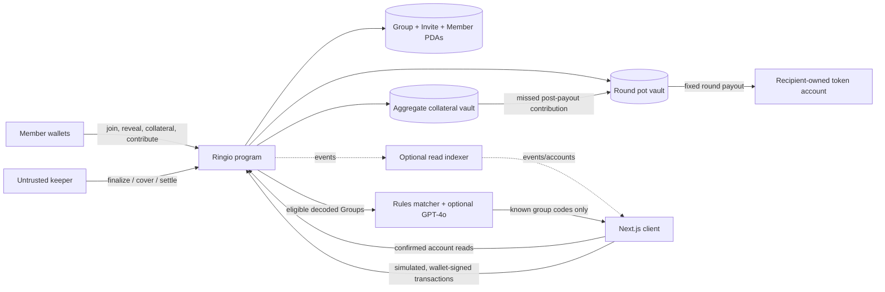

# Ringio MVP Architecture

Status: design contract synchronized to the program source for the devnet MVP. The program was first written with Anchor and has been rewritten with Pinocchio to cut deployment rent (657 KB → ~92 KB binary, ~4.6 → ~0.64 SOL locked) while keeping the exact interface: discriminators, Borsh arguments, account order and layouts, events, account-validation order, and error codes. A differential LiteSVM suite runs every step of its scenarios against both builds. Program ID `JBhfRyHLDdTyGKz78hzeA26kKmtwd37PFkX3tvwmbmYy` is deployed on Solana devnet (currently the Anchor build) and synchronized across source and the frontend. Its config PDA is initialized and a funded two-member Group completed two rounds, including one post-payout default covered from collateral. The web client now builds, simulates, and wallet-signs every user-facing instruction (create, invite, join, reveal, finalize, collateral, activate, contribute, settle, cover, abort, cancel, and both refunds) on any configured cluster — mainnet-beta, devnet, or testnet — and those builders are executed against the program bytecode in LiteSVM. Mainnet and testnet still require a program deployment and config initialization (see `docs/mainnet-deployment.md`). Features explicitly marked **Roadmap** are not part of the implemented MVP.

## 1. Product and security boundary

Ringio is an invite-only, fixed-roster USDC savings circle on Solana. A circle has `N` members, `N` rounds, a fixed contribution `c`, and one recipient per round. Every member contributes once per round; the round pot is `N * c` and is paid to the recipient assigned to that round.

The MVP makes one narrow economic promise:

> Once a member has received the pot, rank-aware collateral can replace that member's remaining scheduled contributions.

It does **not** promise that every circle will finish. In particular, a member who has not received a pot can stop contributing and terminate the active cycle. The MVP contains that risk socially with an invite-only roster and technically with a fail-closed `Defaulted` path and explicit refunds for the failed round. It does not hide that residual risk behind a generic “fully collateralized” label.

The program is non-custodial in the operational sense: tokens sit in program-derived SPL Token accounts and can move only through program rules. Upgrade authority, RPC operators, the web client, and optional keepers remain separate trust surfaces described below.

## 2. MVP decisions

| Decision | MVP choice | Reason |
| --- | --- | --- |
| Membership | Closed, explicit invitations | Fastest useful Sybil/default-risk boundary for real-world trust groups |
| Asset | One immutable standard SPL token mint per group | Keeps all accounting in one asset and avoids Token-2022 extension surprises; the client must separately verify that the selected mint is the intended USDC |
| Terms | Immutable from group creation | Prevents creator repricing, reordering, or shortening deadlines after invitations are accepted |
| Recipient order | Commit-reveal entropy, deterministic on-chain derivation | Auditable and dependency-light; residual abort bias is explicit |
| Default protection | Position-aware collateral for obligations after payout | Directly covers the economically dangerous “take early, stop paying” case |
| Missed-payment handling | Collateral replaces a due contribution; it is not burned | Makes the pot whole instead of creating a punitive treasury |
| Payout | Permissionless `settle_round` to a token account owned by the scheduled recipient | No recipient availability requirement and no trusted scheduler; ATA is a client convention |
| Automation | Permissionless crank; no autonomous private key | Anyone may advance valid state, but value-moving user actions still require wallet approval |
| Data plane | Program accounts and events are canonical | A backend/indexer may improve reads and discovery, but cannot decide balances or recipients |
| AI discovery | Retrieval-first matching over public listings | GPT-4o may explain or rerank known groups; it cannot authorize membership, alter terms, or move funds |

## 3. Components and money flow



Solana has no background execution. “Automatic” means that any wallet or keeper can submit a valid crank transaction. The program independently checks every deadline, account, amount, and destination; a keeper has no discretion over who receives funds.

The checked-in web app connects Wallet Standard wallets and decodes Group, Member, Invite, mint, and SPL-vault accounts through confirmed RPC reads on the selected cluster. `web/src/lib/ringio/` hand-encodes every instruction from the handlers in `programs/ringio/src/processor.rs`; `web/src/hooks/use-ringio-tx.ts` simulates each transaction before any wallet prompt (surfacing decoded program errors), sizes the compute budget, adds a priority fee only on mainnet, requires a one-time risk acknowledgement before the first mainnet signature, and confirms by polling signature status. A per-wallet action planner (`lifecycle.ts`) mirrors the program's state and deadline checks so the UI only offers transitions the program will accept; the program remains the authority.

## 4. Lifecycle state machine

Group lifecycle:

```text
Forming
  -> Revealing
  -> Collateralizing
  -> Active(Collecting round 0..N-1)
  -> Completed

Pre-activation failure -> Cancelled -> individual collateral refunds
Uncovered active default -> Defaulted -> failed-round refunds -> collateral refunds
Global config pause       -> blocks progression and termination; refunds remain callable
```

Round lifecycle:

```text
Collecting
  |-- member contributes ----------------------------|
  |-- deadline passes; paid recipient misses --------|-> cover_default
  |-- grace passes; unpaid pre-payout member --------|-> abort_uncovered_round
  v                                                   |
all N obligations accounted for <--------------------|
  -> settle_round (permissionless)
  -> transfer exactly N*c to fixed recipient
  -> advance round/deadline, or Complete
```

Important transition rules:

- Economic parameters are immutable after `create_group`. The target roster size is fixed, invites are explicit, and the last valid `join_group` moves the full roster into `Revealing`.
- No collateral is required until the order is final, so each member can see the exact requirement before funding it.
- `activate_group` succeeds only when every member has posted the exact required amount.
- One obligation can be accounted for only once: either by a direct contribution or by eligible collateral coverage.
- `settle_round` is valid only when all `N` obligations for that round are accounted for and the pot vault has at least the exact payout.
- A pre-activation timeout can lead to `Cancelled`. An uncovered pre-payout default during an active round leads to `Defaulted`; `refund_failed_round` first returns value accounted into that failed pot, then `refund_collateral` returns each member's remaining ledger balance.
- While globally paused, every lifecycle/progression instruction—including settlement, default coverage, abort, and cancellation—fails. Only `refund_failed_round` and `refund_collateral` remain available so an existing terminal state cannot be trapped.
- Pause freezes protocol time rather than granting a fresh window. `GlobalConfig.total_paused_seconds` increases only by the measured duration of a completed `false -> true -> false` interval. `Group.phase_pause_snapshot` records that total at Group creation and at the start of Revealing, Collateralizing, Active, and every new round. An effective boundary is `base_deadline + (config.total_paused_seconds - group.phase_pause_snapshot)`. A pause begun after an already-expired boundary remains expired because wall time and the effective deadline advance by the same pause duration. Multiple pauses add only actual paused time; repeated same-state calls are no-ops.

## 5. Fair order without an oracle

The dependency-light MVP uses a commit-reveal ceremony:

1. On `join_group`, member `m` submits `commitment_m = H(domain, group, member, secret_m)`; the creator supplies the same kind of commitment in `create_group`.
2. The final accepted member completes the fixed roster and moves the group to `Revealing`; no later invite or member can be added.
3. Each member calls `reveal_secret(secret_m)`; the program verifies the commitment and stores a domain-separated reveal digest.
4. After all valid reveals, anyone calls `finalize_order`.
5. The program XOR-mixes all frozen reveal digests into `entropy`. Each member receives `score_m = H(domain, group, entropy, member_pubkey)`; ascending score, with pubkey as a collision tiebreaker, defines the payout order.

There must be no caller-supplied permutation and no creator override. A missing reveal fails closed before activation; it does not silently substitute a caller-controlled seed.

The program rejects an all-zero reveal. Clients must generate each 32-byte secret with a cryptographically secure random-number generator, persist it privately until reveal succeeds, and never derive it from a wallet address, timestamp, group code, or human password. Losing the secret can force cancellation; exposing it before the roster commitments are fixed weakens the ceremony.

Residual limitation: the last revealer can inspect the prospective result and abort if it dislikes its position. Failing closed prevents it from selecting a different completed order, but does not prevent griefing or “abort until favorable” selection across repeated circles. A verifiable randomness integration is a roadmap option after the MVP proves demand.

## 6. Default-risk economics

Let:

- `N` be the number of members and rounds;
- `c` be the per-member contribution per round in raw mint units;
- `r_i` be member `i`'s zero-based payout position.

Immediately after receiving the round-`r_i` pot, member `i` still owes:

```text
required_collateral_i = c * (N - r_i - 1)
```

Examples for a four-member circle with `c = 100 USDC`:

| Payout position | Future obligations after payout | Required collateral |
| ---: | ---: | ---: |
| 1st (`r=0`) | 3 | 300 USDC |
| 2nd (`r=1`) | 2 | 200 USDC |
| 3rd (`r=2`) | 1 | 100 USDC |
| 4th (`r=3`) | 0 | 0 USDC |

The total collateral locked at activation is `c * N * (N - 1) / 2`. This is deliberately capital-inefficient. It buys simple, inspectable solvency for post-payout obligations without introducing price oracles, volatile collateral, liquidation bots, or governance judgment.

All multiplication and summation must use checked arithmetic, with a wider intermediate type, before conversion to token `u64` amounts. Circle size and contribution amount need hard caps.

### Protection Ratio

The dashboard's Protection Ratio measures coverage, not trust or probability of completion. If `q` is the current unsettled round, let `R_i(q)` be `1` when that member's current-round obligation has already been resolved directly or from collateral and `0` otherwise. The remaining covered obligation of a member who received a pot in an earlier round is:

```text
O_i(q) = c * (N - q - R_i(q))
```

Members who have not received a pot yet are excluded. This adjustment matters because a successful direct contribution returns one collateral slice before `settle_round` advances `q`.

Let `L_i` be that member's `Member.collateral_locked` ledger balance in the aggregate collateral vault. Effective backing is `B_i(q) = min(L_i, O_i(q))`, and:

```text
Protection Ratio(q) = sum(B_i(q)) / sum(O_i(q))
```

If there are no post-payout obligations, display `N/A`, not an invented `100%`. Cap excess collateral at the obligation in this metric so over-locking cannot disguise another member's shortfall.

The UI must show Protection Ratio beside a separate collection/liveness signal: paid count, unpaid wallets, and deadline. A circle can be 100% protected against early-recipient default and still be stalled by a member who has not yet received a pot.

### Why coverage, not slashing

For an eligible post-payout default, `cover_default` transfers exactly `c` from the aggregate collateral vault into the pot vault, decrements only that member's `collateral_locked` ledger by `c`, and marks the round obligation as covered. If the post-payout member contributes directly, `contribute` transfers `c` into the pot and returns one `c` collateral slice from the aggregate vault to that member in the same atomic transaction. Burning funds or paying an admin would weaken participants while leaving the pot short.

## 7. Accounts

Seeds below match the checked-in source. The client builders in `web/src/lib/ringio/` are the interface reference; there is no generated IDL.

| Account | Intended derivation/owner | Important data or constraint |
| --- | --- | --- |
| `GlobalConfig` | `PDA("config")` | version, admin, pause authority, `paused`, `paused_at`, and cumulative `total_paused_seconds`; no vault-withdraw or mint-approval power |
| `Group` | `PDA("group", creator, group_id)` | immutable terms; fixed 32-slot member/order arrays; lifecycle/base deadlines; `phase_pause_snapshot`; current/failed round; counts; aggregate collateral total; entropy |
| `Invite` | `PDA("invite", group, invitee)` | exact group and invitee, one-time-used marker |
| `Member` | `PDA("member", group, wallet)` | commitment/reveal digest, joined index, payout rank, per-round marker, resolution kind, `collateral_locked`, payout/default/refund state |
| Pot vault | `PDA("pot-vault", group)`, SPL token account controlled by Group PDA | exact group mint; receives direct and covered contributions; pays only scheduled recipient or failed-round refunds |
| Aggregate collateral vault | `PDA("collateral-vault", group)`, SPL token account controlled by Group PDA | exact group mint; custody for all member collateral; debits must reconcile to a specific `Member.collateral_locked` ledger change |
| Member-owned token account | Classic SPL Token account with the group mint | source, payout, and refund destination after owner/mint checks; an ATA is the client convention, not a program requirement |

The aggregate vault saves token-account rent but creates a strong conservation requirement: its balance must cover the sum of all member collateral ledgers, and one member's coverage/refund must never debit another member's tracked share. `Group.total_collateral_locked` is an aggregate accounting field, not an admin withdrawal allowance.

The bounded MVP roster is `2..=32`. `Group` stores fixed arrays for the canonical members and payout order; `Member.last_contributed_round` and `last_resolution_kind` provide current-round evidence without an unbounded history vector. Events are needed for full historical projection.

### Client period entry

`Group.period_seconds` is the only on-chain cadence source of truth. The create-circle client offers Weekly (7 days), Every 2 weeks (14 days), and Monthly (exactly 30 days) presets, plus a custom positive integer in minutes, hours, days, or weeks. Every choice is converted to an exact integer number of seconds before an instruction is built; the client enforces the same upper bound as the program (`366 days`) and displays the resulting duration in the economics preview. A calendar-month interpretation is intentionally avoided because it would be ambiguous in an immutable seconds-based term. Client validation is only an early UX check: `create_group` must continue to reject zero, overflow, and out-of-range values on-chain.

## 8. Instruction surface

These are the MVP instruction names; exact arguments and account lists are in `programs/ringio/src/processor.rs` and the client builders.

| Instruction | Who may call | Critical checks and effects |
| --- | --- | --- |
| `initialize_config` | current program upgrade authority | initialize once; require the executable Ringio program, its canonical ProgramData account, and the current upgrade-authority signer; bind admin and pause authority |
| `set_paused` | pause authority | on a real pause, record `paused_at`; on a real resume, add exactly `now - paused_at` to cumulative paused time using checked arithmetic; repeated same-state calls are no-ops; no custody or ordering authority |
| `update_pause_authority` | admin | rotate the narrowly scoped pause authority |
| `create_group` | creator | validate `N`, `c`, period/grace/windows and deadlines; bind mint and initialize both vaults |
| `invite_member` | creator | only while inviting; unique wallet; cannot exceed capacity |
| `join_group(commitment)` | invited wallet | signer matches unused invite; unique member; nonzero/domain-bound commitment; full roster moves to Revealing |
| `reveal_secret(secret)` | joined member | reject an all-zero secret; recompute commitment; one valid reveal only |
| `finalize_order` | anyone | all reveals present; derive one deterministic immutable order |
| `post_collateral` | member | transfer exact rank-aware requirement and credit that member's ledger once |
| `activate_group` | anyone | every member posted required collateral; aggregate vault reconciles; set round zero start |
| `contribute` | any current member | unpaused Active state and no later than the effective round boundary; once only; transfer exactly `c`; if already paid out, atomically release one `c` collateral slice |
| `cover_default` | anyone | unpaused; effective grace boundary elapsed; member already received pot and remains unresolved; move exactly `c` aggregate collateral to pot and debit only its ledger |
| `settle_round` | anyone | unpaused; all obligations accounted; exact owner and amount; destination may be any correct-mint classic token account owned by the scheduled recipient |
| `abort_uncovered_round` | anyone | unpaused; effective grace boundary elapsed with an unresolved pre-payout member; mark Active group Defaulted and freeze failed round |
| `cancel_group` | creator while Forming; otherwise anyone after the applicable effective incomplete-phase deadline | unpaused; mark an incomplete pre-activation group Cancelled; never ordinary post-payout cancellation |
| `refund_failed_round` | anyone paying the transaction fee; fixed member destination/ledger | in Defaulted group, refund that member's direct contribution, or restore a covered slice to that member's collateral ledger, once |
| `refund_collateral` | member signer | terminal/refundable state; transfer only to a token account owned by that signer; once only |

Every handler must validate PDA seeds, account ownership, token mint, token authority, group linkage, signer, lifecycle state, and one-time markers. Account checks mirror the former Anchor constraints but are not a substitute for explicit economic invariants.

## 9. Required invariants

1. **Conservation:** token outflow from program vaults equals scheduled payouts, eligible collateral refunds, or explicitly declared fees; no arbitrary destination exists.
2. **Mint integrity:** every source, vault, and destination token account uses the group's immutable configured mint. This proves internal consistency, not that the mint is authentic USDC.
3. **Fixed pot:** a normal settled payout is exactly `N * c`; excess dust is never silently included.
4. **Single accounting:** a wallet's obligation for `(group, round)` is direct, covered, or unpaid—never two of these.
5. **Fixed recipient:** the recipient is read from the finalized on-chain order; a keeper cannot supply a different beneficiary.
6. **Monotonic state:** round, paid count, contribution marker, payout marker, and refund marker cannot move backwards or repeat.
7. **Collateral ledger conservation:** aggregate collateral custody covers all `Member.collateral_locked` balances; a debit changes exactly the matching member and group totals.
8. **No economic mutation:** membership target, `N`, `c`, period/grace/windows, mint, and order algorithm cannot change after group creation; roster additions end when full.
9. **Deadline source:** eligibility uses the on-chain `Clock`, not client time. UX countdowns are advisory.
10. **Atomic settlement:** a failed token CPI leaves round state unchanged; a successful transaction cannot pay twice.
11. **Pause freeze accounting:** pause cannot move funds and refunds remain callable. Only completed real pause intervals add to cumulative paused time; each phase snapshots the prior total; effective deadlines extend by exactly the paused duration since that snapshot. Same-state calls add zero, and pausing after expiry cannot revive a deadline.
12. **Destination ownership:** payout/refund accounts use the group mint and are owned by the scheduled wallet. ATA derivation is not an authorization invariant.

## 10. Threat model

Assets: pot funds, collateral, payout order, contribution evidence, terminal refunds, and availability of state transitions.

Adversaries: a malicious creator, one or more colluding members, a keeper, a compromised web client, a stale/malicious RPC, the config/upgrade authority, and an attacker passing crafted accounts.

| Threat | MVP control | Residual risk / required disclosure |
| --- | --- | --- |
| Early recipient takes pot and stops paying | rank-aware collateral; permissionless default cover | Only post-payout scheduled obligations are economically covered |
| Pre-payout member stops paying | invite-only membership; visible deadline; permissionless abort and failed-round refunds | Group terminates `Defaulted`; promised future pots are not completed; replacement/insurance is roadmap |
| Creator changes terms or recipient | immutable terms from group creation; deterministic order after full reveal | Creator can refuse to progress before permissionless stages unless timeout/cancel paths are complete |
| Duplicate member or contribution | PDA uniqueness and per-member round marker | Wallet-level uniqueness does not prevent one human controlling many wallets |
| Fake USDC or wrong token account | immutable group mint plus token mint/owner/authority checks; the client creates circles only with the cluster's configured mint and badges every circle as verified USDC or an unverified token | The program accepts a standard SPL mint; it does not prove that mint is official USDC. Circles created outside this client can use any mint |
| Keeper steals or front-runs payout | permissionless call with fixed amount and scheduled token-account owner | A keeper may choose among correct-mint accounts owned by that recipient, but cannot pay itself; it can censor only by not acting and anyone else can call |
| Order manipulation | commitments frozen before reveals; canonical deterministic ordering | Last-revealer abort/griefing remains; VRF is roadmap |
| Premature default cover | on-chain deadline, unpaid marker, post-payout eligibility | Cluster time is approximate; periods must tolerate clock variance |
| Malicious/stale frontend or RPC | client-side account decoding; every transaction is simulated before the wallet prompt; network, asset mint, and amount are shown next to every signing action; mainnet requires an explicit risk acknowledgement | A user can still approve a malicious transaction from a compromised frontend; verify program ID and explorer data |
| Arithmetic/account substitution | checked arithmetic, caps, PDA and `has_one`/mint/owner checks | Requires tests and independent review; documentation is not an audit |
| Token-2022 transfer hooks/fees | standard SPL Token mint only in MVP | Token-2022 support needs extension-aware accounting before enablement |
| Pause/admin abuse | pause cannot transfer/reorder; failed-round and collateral refunds remain available; cumulative accounting freezes every phase by only its actual paused duration | The authority can delay liveness indefinitely while paused, but cannot revive an expired boundary or add unpaused time. Pause and upgrade authorities remain disclosed devnet trust assumptions |
| Config initialization takeover | canonical executable ProgramData and current upgrade-authority signer are required | The upgrade authority remains a powerful devnet trust root and can replace program logic until governed or removed |
| Program upgrade compromise | publish program ID and upgrade authority; verify build | Mainnet needs multisig/timelock or immutability; not solved by MVP |
| Lost member key | none in v1 | Funds/liveness may be impaired; recovery delegates are roadmap and add trust |
| Reputation gaming | raw on-chain evidence first | Passport scores are Sybil/collusion-sensitive and must not be marketed as creditworthiness |
| AI invents or leaks group data | deterministic retrieval first, known-code allowlist, bounded JSON response, PII/secret rejection | Provider policy, prompt injection, stale availability, bias, and paid-endpoint abuse still need operational monitoring |

## 11. Keeper and agent interface

`finalize_order`, `activate_group`, `cover_default`, `settle_round`, and `abort_uncovered_round` are keeper-friendly because they are deterministic and permissionless. A keeper observes accounts/events, simulates the exact instruction, and submits only when the program says the transition is valid. It never holds member seed phrases or chooses payout destinations.

**Implemented discovery manifest:** `GET /api/agent/manifest` returns project/version, the enabled clusters with their program IDs and asset mints, the browser-signed transaction mode, a small supported-action list, the narrow collateral guarantee/exclusions, and `signableTransactions: false`. It reflects configuration only; it is not RPC/deployment evidence. This is capability metadata: it returns no transaction, mutates no state, and does not claim Solana Actions/Blinks compliance.

**Roadmap — transaction-capable action manifest:** add the reviewed program build hash, required accounts/signers, preconditions, raw-amount semantics, expected postconditions, simulation response, and human-confirmation policy after the transaction client exists. `join_group`, `reveal_secret`, `post_collateral`, and `contribute` remain explicit user-signature actions. A bounded keeper may submit only permissionless cranks.

## 12. AI discovery and public group codes

The AI matcher is a separate read-only discovery plane. The deterministic matcher hard-filters only catalog eligibility/open capacity and an explicitly stated maximum budget. Cadence, language, location, start timing, group size, interests, and non-maximum contribution targets remain scored preferences with visible tradeoffs. If a server-only OpenRouter key is present, `openai/gpt-4o` may rerank that bounded candidate set and explain matches using a strict JSON response. A missing key, timeout, malformed payload, unknown code, or provider failure falls back to deterministic results.

Only discoverable listing fields may enter the prompt: public code, display name, fixed contribution, cadence, languages, advertised location mode/city, start date, open slots, collateral scope, and bounded interest tags. Member wallets, invite records, contact details, secrets, private chat, and transaction histories are rejected and never intentionally sent to the model. The matcher cannot create an invite, bypass `join_group`, submit a transaction, or promise completion.

`RNG-XXXXXXXXXXXX` is a case-insensitive public lookup code derived from the first 48 bits of a Group address, not authentication. Exact lookup is reconciled against the full decoded account, and no static runtime catalog exists. A production indexer must retain collision handling and add signed/versioned creator metadata without becoming an authority over funds. See `docs/ai-matching.md` for the HTTP contract and production dependencies.

## 13. Proof of contribution and portable trust

The MVP's canonical evidence is the `Member` state plus emitted events: accepted invitation, direct contribution, collateral-covered miss, payout, and completed circle. The UI must distinguish an on-time contribution from a collateral-covered default.

**Roadmap — opt-in Trust Passport:** an indexer can derive an explainable record such as completed circles, on-time/total obligations, covered defaults, volume, age, and counterparty diversity. A portable on-chain passport may commit to these claims or reference signed attestations. It must remain opt-in, expose methodology, avoid PII, and never claim to prove one human per wallet or future creditworthiness.

## 14. Implemented MVP versus roadmap

Repository snapshot on 2026-08-12 (Anchor build): Rust 1.89 formatting, 16/16 unit tests, clippy with warnings denied, IDL generation, and SBF build passed, and the local SBF artifact hash matched the dumped devnet bytecode. After the Pinocchio rewrite, the unit tests, the LiteSVM lifecycle suite, and the differential suite (including forged/substituted accounts, replays, malformed data, and a 32-member circle) pass against the new build. Devnet deployment, canonical config initialization, confirmed-RPC decoding, deterministic AI matching, and homepage/API smoke checks succeeded. A repo-external three-keypair harness completed a funded two-member, two-round lifecycle using Circle devnet USDC: join/reveal/order, collateral, direct contributions, two payouts, an expected pre-grace default-cover rejection, post-grace collateral coverage, `Completed`, zero pot/collateral vault balances, and participant-balance conservation were asserted. Node 20.19.4 frontend lint, typecheck, build, 17/17 duration/matcher/privacy/binary-decoder tests, and dependency audit with zero reported vulnerabilities pass. Live OpenRouter evidence, fuzzing, and a funded devnet run on the Pinocchio build remain open.

| Capability | Checked in now | Roadmap / not implied |
| --- | --- | --- |
| Invite-only fixed roster | Program source, state/unit checks, LiteSVM suites, funded two-member devnet completion, browser invite/join builders | Identity verification, replacement membership |
| Group discovery | Direct devnet Group decoding with PDA-derived public codes; deterministic matcher; optional OpenRouter explanation; no mock fallback | Signed creator metadata, scalable indexer, moderation, production rate limiting |
| Commit-reveal order | Deterministic deployed instruction, pure ordering tests, browser ceremony with wallet-signature-derived secrets (local backup, on-chain commitment check before reveal) | VRF/liveness-resistant randomness |
| SPL contributions and PDA vaults | Classic Token Program constraints, conservation tests, funded direct contributions and payouts, terminal zero-vault assertions | Exhaustive malicious-account CPI tests, Token-2022, yield-bearing vaults, swaps |
| Rank-aware collateral and Protection Ratio | Aggregate ledger plus funded pre-grace rejection and post-grace default coverage on devnet | Insurance fund, credit underwriting, liquidation |
| Permissionless round/default crank | Independent keeper finalized order, activated, covered default, and settled payouts | Hosted keeper, monitoring/SLA, autonomous custody |
| Dashboard | Real Group/Member/Invite/vault reads on mainnet-beta, devnet, or testnet; per-wallet action planner; simulated, wallet-signed transactions for every user and crank instruction; LiteSVM lifecycle tests against deployed bytecode | Production indexer, notifications, hosted keeper |
| Contribution evidence | Completed funded devnet Group with direct versus collateral resolution in member state | Indexed history, portable Trust Passport, cross-protocol attestations |
| Agent capability metadata | Read-only `/api/agent/manifest`; no signable transactions | Transaction-capable manifest, reviewed interface binding, and delegated policies |

## 15. Mainnet exit criteria

Devnet completion is not production readiness. Before mainnet: reconcile docs with the program interface; extend transition and adversarial account-substitution coverage; fuzz arithmetic/state transitions; independently review token and authority paths; define upgrade/pause governance; re-measure transaction/account costs at maximum roster size on a live cluster; publish program ID and verified build; complete legal/regulatory review; run a capped-value pilot; and document a recovery procedure that does not invent unsafe post-payout refunds.
